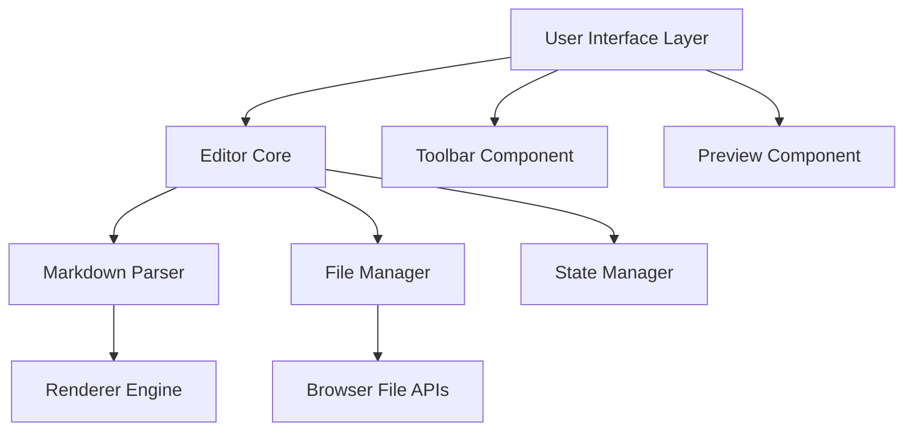

# Design Document

## Overview

The markdown WYSIWYG editor will be a single-page web application built with vanilla JavaScript, HTML5, and CSS3. It will use the browser's File System Access API (with fallback to traditional file input/download) for local file operations and a contentEditable-based editor with markdown parsing capabilities.

## Architecture

### High-Level Architecture



### Core Components

1. **Editor Core**: Central orchestrator managing editor state and coordinating between components
2. **WYSIWYG Editor**: ContentEditable-based editor with custom formatting logic
3. **Markdown Parser**: Bidirectional converter between markdown and HTML
4. **File Manager**: Handles local file operations using browser APIs
5. **Toolbar**: Formatting controls and file operations
6. **Preview Pane**: Real-time markdown rendering
7. **State Manager**: Manages editor state, undo/redo, and change tracking

## Components and Interfaces

### EditorCore Class
```javascript
class EditorCore {
  constructor(container)
  loadFile(file)
  saveFile(filename)
  getMarkdown()
  setMarkdown(content)
  getHTML()
  applyFormatting(type, options)
  togglePreview()
}
```

### MarkdownParser Class
```javascript
class MarkdownParser {
  toHTML(markdown)
  toMarkdown(html)
  sanitizeHTML(html)
  validateMarkdown(content)
}
```

### FileManager Class
```javascript
class FileManager {
  openFile()
  saveFile(content, filename)
  supportsFileSystemAccess()
  downloadFile(content, filename)
}
```

### Toolbar Class
```javascript
class Toolbar {
  constructor(editorCore)
  addButton(type, config)
  updateButtonStates()
  handleFormatting(type)
}
```

## Data Models

### Editor State
```javascript
{
  content: {
    markdown: string,
    html: string,
    isDirty: boolean
  },
  ui: {
    showPreview: boolean,
    activeFormatting: Set<string>,
    cursorPosition: number
  },
  file: {
    name: string,
    lastSaved: Date,
    hasUnsavedChanges: boolean
  }
}
```

### Formatting Commands
```javascript
{
  bold: { tag: 'strong', markdown: '**text**' },
  italic: { tag: 'em', markdown: '*text*' },
  header1: { tag: 'h1', markdown: '# text' },
  header2: { tag: 'h2', markdown: '## text' },
  code: { tag: 'code', markdown: '`text`' },
  link: { tag: 'a', markdown: '[text](url)' }
}
```

## Error Handling

### File Operation Errors
- **File Access Denied**: Graceful fallback to download/upload methods
- **Invalid File Format**: Display warning and load as plain text
- **File Too Large**: Implement size limits with user notification
- **Browser Compatibility**: Feature detection with appropriate fallbacks

### Editor Errors
- **Parsing Errors**: Maintain last valid state and show error indicators
- **Formatting Conflicts**: Resolve through precedence rules
- **State Corruption**: Implement auto-recovery from localStorage backup

### Error Recovery Strategy
1. Automatic state backup to localStorage every 30 seconds
2. Graceful degradation for unsupported browser features
3. User notification system for non-critical errors
4. Emergency content export for critical failures

## Testing Strategy

### Unit Testing
- Markdown parser accuracy (markdown ↔ HTML conversion)
- File manager operations with mocked browser APIs
- Formatting command execution and state management
- State persistence and recovery mechanisms

### Integration Testing
- End-to-end file operations (open → edit → save)
- Cross-browser compatibility testing
- Keyboard shortcut functionality
- Undo/redo operation chains

### User Acceptance Testing
- Content creation workflows
- File management operations
- Preview accuracy validation
- Performance with large documents

## Implementation Details

### Browser API Strategy
- **Primary**: File System Access API for modern browsers
- **Fallback**: Traditional input[type="file"] and download links
- **Detection**: Feature detection with progressive enhancement

### Markdown Processing
- **Library**: Custom lightweight parser optimized for real-time editing
- **Rendering**: Incremental updates to minimize DOM manipulation
- **Sanitization**: XSS protection for user-generated content

### Performance Optimizations
- **Debounced Updates**: 300ms delay for preview updates
- **Virtual Scrolling**: For large documents (>1000 lines)
- **Lazy Loading**: Load formatting libraries on demand
- **Memory Management**: Cleanup event listeners and DOM references

### Accessibility Features
- **Keyboard Navigation**: Full keyboard support for all operations
- **Screen Reader**: ARIA labels and semantic HTML structure
- **High Contrast**: CSS custom properties for theme support
- **Focus Management**: Proper focus handling during mode switches